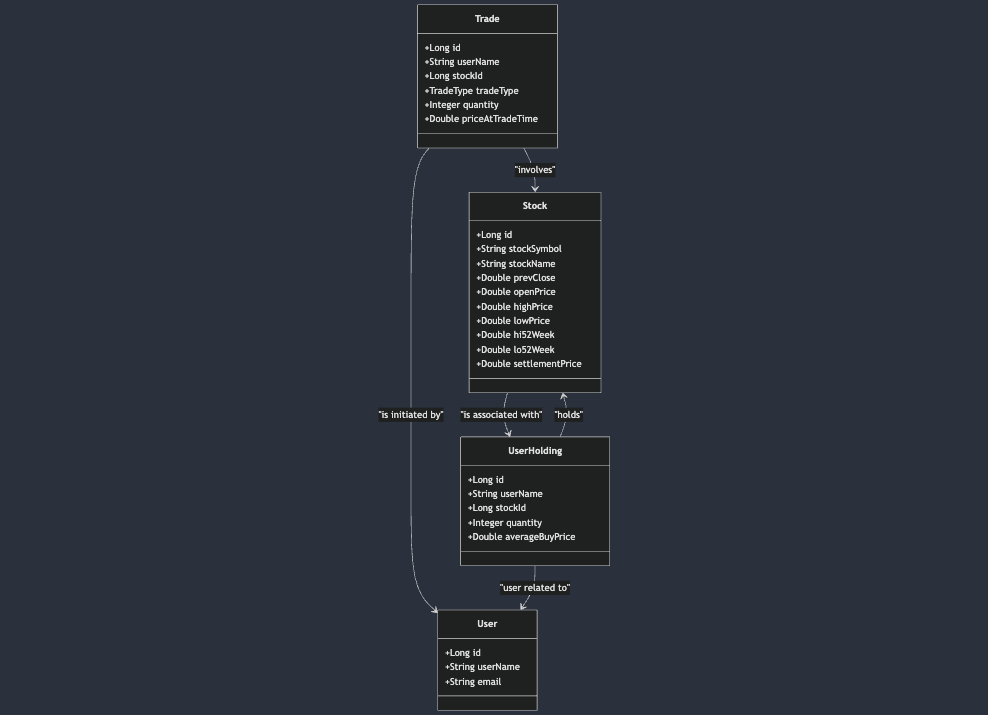
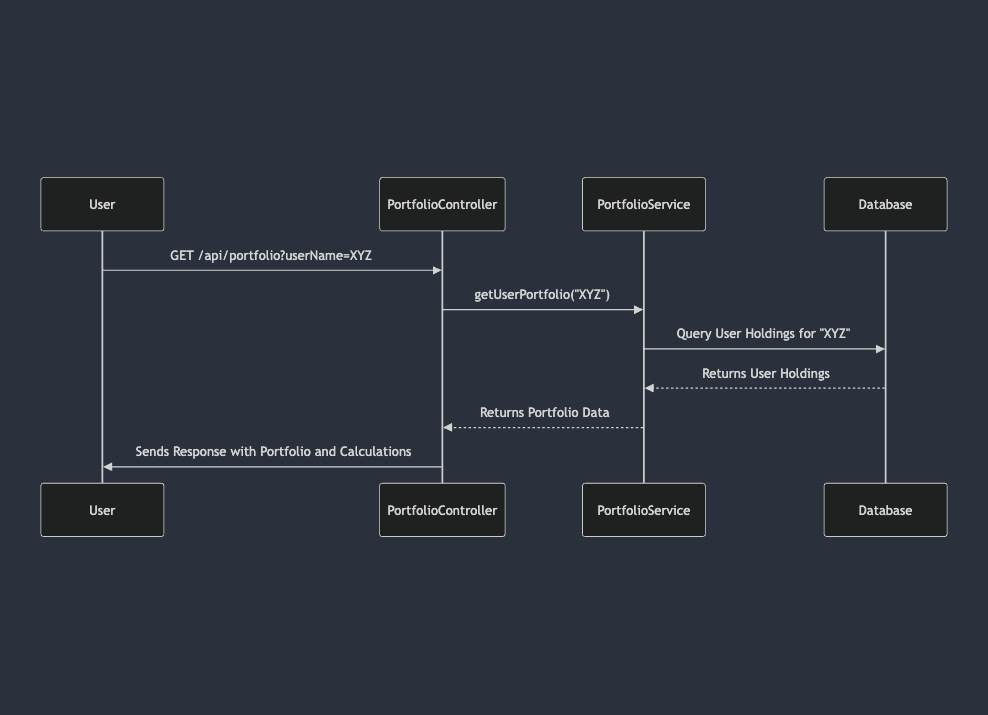
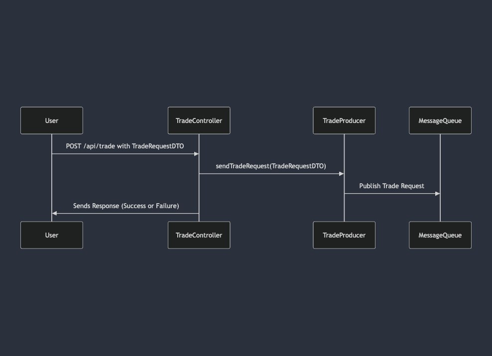
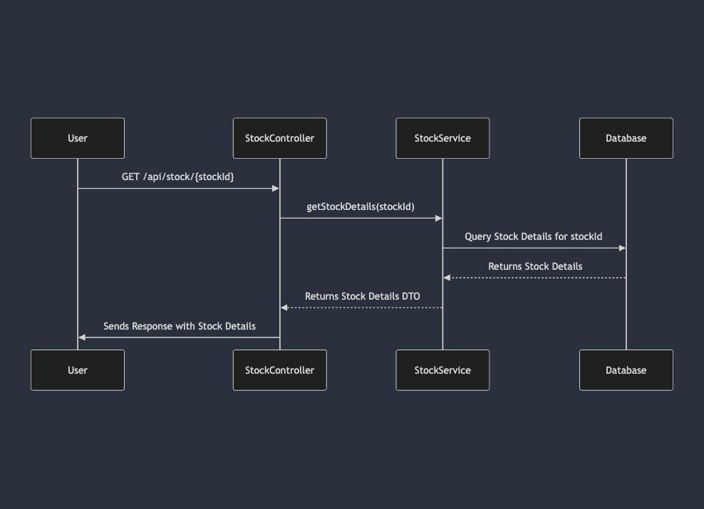

# Portfolio Management API Documentation

---

## 1. Overview
This application is a **Portfolio Management API** designed for managing trades, user portfolios, stock updates, and associated functionalities. Built using Spring Boot, it integrates Swagger for API documentation.

**Key Features**:
- User portfolio management.
- Stock trading operations.
- Update and query stock details.
- RESTful API design.

---

## 2. API Documentation

### Base URL
`/api`

### Endpoints
### User APIs

| **HTTP Method** | **Endpoint**                | **Description**                               |
|------------------|-----------------------------|-----------------------------------------------|
| **POST**         | `/api/user`                | Create a new user with an initial portfolio.  |

### Portfolio APIs

| **HTTP Method** | **Endpoint**                | **Description**                               |
|------------------|-----------------------------|-----------------------------------------------|
| **GET**          | `/api/portfolio`           | Get portfolio details for a user.            |

### Stock APIs

| **HTTP Method** | **Endpoint**                | **Description**                               |
|------------------|-----------------------------|-----------------------------------------------|
| **GET**          | `/api/stock/{stockId}`     | Get stock details by ID.                     |
| **GET**          | `/api/stock`              | Retrieve all available stocks.               |
| **GET**          | `/api/stock/search`       | Search stocks by name.                       |

### Trade APIs

| **HTTP Method** | **Endpoint**                | **Description**                               |
|------------------|-----------------------------|-----------------------------------------------|
| **POST**         | `/api/trade`              | Execute a trade (buy/sell).                  |
| **POST**         | `/api/trade/close-market` | Close the stock market.                      |

### Update Stocks APIs

| **HTTP Method** | **Endpoint**                | **Description**                               |
|------------------|-----------------------------|-----------------------------------------------|
| **POST**         | `/api/stocks/update`      | Update stocks data from a CSV file.          |
### Example Requests and Responses

#### Fetch All Stocks
**Request:**
```json
[
    {
        "id": 1,
        "stockSymbol": "AAPL",
        "stockName": "Apple Inc.",
        "prevClose": 145.32,
        "openPrice": 146.50,
        "highPrice": 147.00,
        "lowPrice": 145.00,
        "hi52Week": 180.50,
        "lo52Week": 120.00,
        "settlementPrice": 146.00
    }
]
```
####    Create a Trade
**Request**
```json
{
"userName": "johndoe",
"stockId": 1,
"tradeType": "BUY",
"quantity": 10,
"priceAtTradeTime": 146.50
}
```


#### Fetch All Stocks

- **Method**: GET
- **Endpoint**: `/api/portfolio/{userId}`


```json
[
  {
    "stockId": 1,
    "stockName": "APPLLE  INC",
    "quantity": 10,
    "buyPrice": 150.50,
    "currentPrice": 170.00,
    "gainLoss": 19.50,
    "gainLossPercent": 12.96
  },
  {
    "stockId": 2,
    "stockName": "Google LLC",
    "quantity": 5,
    "buyPrice": 2500.00,
    "currentPrice": 2600.00,
    "gainLoss": 100.00,
    "gainLossPercent": 4.00
  }
]
```
#### Create New User

- **Method**: POST  
- **Endpoint**: `/api/user`

#### Request Body:
```json
{
  "username": "string",
  "email": "string",
  "portfolio": [
    {
      "stockId": 1,
      "stockName": "APPLE INC",
      "quantity": 10,
      "buyPrice": 150.50,
      "currentPrice": 170.00,
      "gainLoss": 19.50,
      "gainLossPercent": 12.96
    }
  ]
}
```
## 3. UML Diagrams

### UML Class Diagram


This diagram illustrates the relationships and attributes of the key entities within the application, such as `Stock`, `User`, `Trade`, and `UserHolding`.

---

### Sequence Diagram - User Portfolio


This sequence diagram demonstrates the interactions between components when a user requests their portfolio, showing the flow of data and processing from the API to the database.

---

### Sequence Diagram - Trade


This sequence diagram represents the flow of a trade transaction, including the interaction with the `TradeProducer` and the message queue.

---

### Sequence Diagram - Stock Update


This sequence diagram represents the flow of a stocks transaction, including the interaction with the `stocks` and the `user`.

